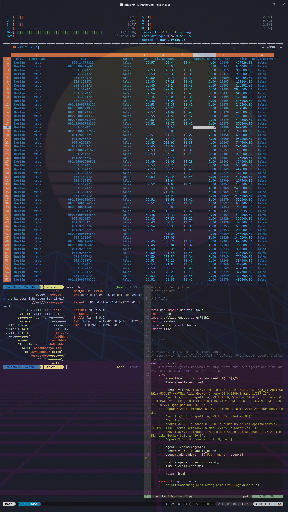

# Development / Productivity

- [Visual Studio Code](https://code.visualstudio.com/): A text editor / all purposes IDE.
  - AutoFileName
  - Bracket Pair Colorizer 2
  - Excel Viewer
  - Git Project Manager
  - GitLens
  - Json Editor
  - LaTex Workshop
  - Markdown All In One
  - Material Icon Theme
  - One Dark Pro
  - Python Extension
  - Pyright Static Type Checker
  - shell-format
  - Sort Lines
  - Statusbar Error
  - YAML

- [TeX Live](https://www.tug.org/texlive/acquire-netinstall.html): LaTex Distribution for easy properly formatted documents.
- [Anaconda 3](https://www.anaconda.com/distribution/#download-section): All in one data Science distribution with Python 3, DS Python Packages and Virtual Environments.
- [Hyper](https://hyper.is/): A versatile command line interface before waiting for the official release of the [windows console.](https://devblogs.microsoft.com/commandline/introducing-windows-terminal/). Extensions I am using can be found in my dotfiles.

- [Cyberduck](https://cyberduck.io/): To connect to S3 Buckets, FTPs, SFTPs...
- [GPG4Win](https://www.gpg4win.org/): To encrypt in PGP.

## Ubuntu Windows Subsystem for Linux

[Ubuntu WSL](https://docs.microsoft.com/en-us/windows/wsl/install-win10) 

Current set-up with Hyper and Ubuntu WSL looks like this: 

TMUX running HTOP / SC-IM, Screenfetch and NeoVIM. 

Information about the apps for my set-up are available [here](../ubuntu/apps.md)  or through the [install script](../ubuntu/install.sh) directly. 

Configuration files are available in my dotfiles. These are compatible with all Bash shells. 

# Web-browsing

- [Brave](https://brave.com/)
  - Ublock Origin
  - Disconnect
  - Facebook Pixel Tracker
  - Google Analytics Add-on
  - Last-Pass
  - Dataslayer
  
- [Firefox](https://www.mozilla.org/en/firefox/new/)
  - Ublock Origin
  - Disconnect
  - Last-Pass

# Messaging

- [Franz](https://meetfranz.com/): All your messaging apps bundled in one piece of software

# Networking

- [OpenVPN GUI](https://github.com/OpenVPN/openvpn-gui): An Open Source VPN Client.
- [ZeroTierOne](https://www.zerotier.com/) : Simulates a LAN Network on the Internet.